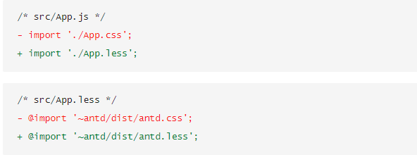

`安装craco`: yarn add @craco/craco

`安装craco-less`：yarn add craco-less

创建`craco.config.js`：
```javascript
const CracoLessPlugin = require('craco-less');

module.exports = {
  plugins: [
    {
      plugin: CracoLessPlugin,
      options: {
        lessLoaderOptions: {
          lessOptions: {
            modifyVars: { '@primary-color': '#1DA57A' },
            javascriptEnabled: true,
          },
        },
      },
    },
  ],
};
```

`antd`自定义主题

