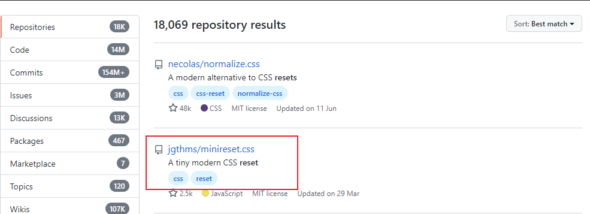
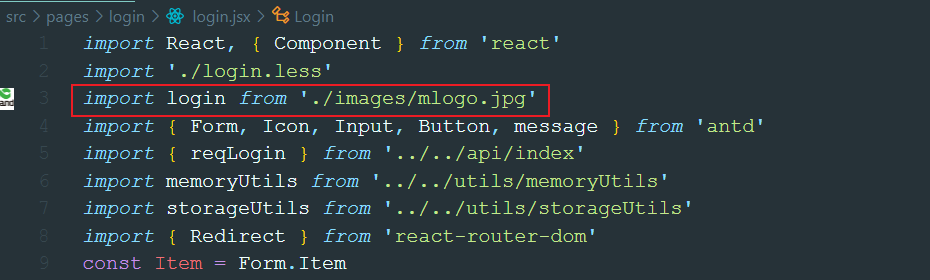

`重置样式`：

`img标签引入图片方式`：

`高阶函数和高阶组件`：

```javascript
1. 高阶函数
    1). 一类特别的函数
        a. 接受函数类型的参数
        b. 返回值是函数
    2). 常见
        a. 定时器: setTimeout()/setInterval()
        b. Promise: Promise(() => {}) then(value => {}, reason => {})
        c. 数组遍历相关的方法: forEach()/filter()/map()/reduce()/find()/findIndex()
        d. 函数对象的bind()
        e. Form.create()() / getFieldDecorator()()
    3). 高阶函数更新动态, 更加具有扩展性

2. 高阶组件
    1). 本质就是一个函数
    2). 接收一个组件(被包装组件), 返回一个新的组件(包装组件), 包装组件会向被包装组件传入特定属性
    3). 作用: 扩展组件的功能

3. 高阶组件与高阶函数的关系
    高阶组件是特别的高阶函数
    接收一个组件函数, 返回是一个新的组件函数
```

`登录表单处理`：

- 收集数据
- 表单验证

`表单格式`：

- form-data
- raw
- binary
- x-www-form-urlencoded(**纯文本表单**)

`暴露`：

- _export default {}_ 统一暴露
- _export_ 分别暴露

`箭头函数`：箭头函数返回不写大括号，如果要写一定要写**return**

`跨域`：

- jsonp 只能处理 GET 请求
- cors 通过后端允许
- 代理

```javascript
3). 解决ajax跨域请求问题(开发时)
    办法: 配置代理  ==> 只能解决开发环境
    编码: package.json: proxy: "http://localhost:5000"
4). 对代理的理解
    1). 是什么?
        具有特定功能的程序
    2). 运行在哪?
        前台应用端
        只能在开发时使用
    3). 作用?
        解决开发时的ajax请求跨域问题
        a. 监视并拦截请求(3000)
        b. 转发请求(4000)
    4). 配置代理
        告诉代理服务器一些信息: 比如转发的目标地址
        开发环境: 前端工程师
        生产环境: 后端工程师
```

`路由跳转`

- 事件回调函数路由跳转 this.prop.push() 和 this.prop.replace()区别

  1. push 层级结构回退
  2. replace 回退不替换

- render()里跳转使用<Redirect />

`持续登录`：刷新不退出
`自动登录`：关闭浏览器不退出
