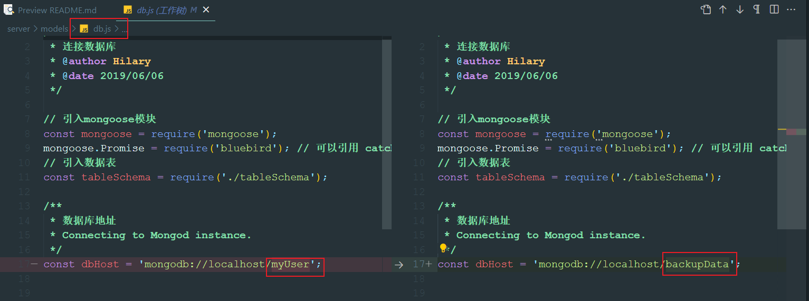
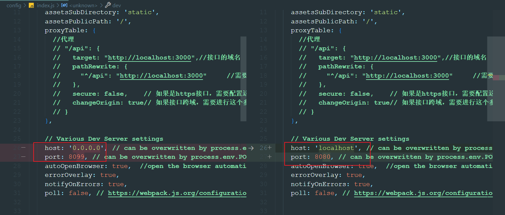

`业务逻辑`：
>1. 管理员新增角色
>2. 为角色指定可见菜单和操作权限
>3. 色分配到指定的用户
>4. 用户登录系统查看权限

`演示博客：` [转载](https://blog.csdn.net/weixin_42512937/article/details/101106950)

`项目地址`：[转载](https://github.com/HilaryHA/RolePerMenManageProject)

`注意版本`：
```javascript
Node.js == v10.13.0
Npm == 6.10.3
Vue == 2.5.2
vue-router == 3.0.1
element-ui == ^2.12.0
```

`导入数据库`
1. MongoDB之数据的备份、还原、导出、导入等简单操作[转载](https://blog.csdn.net/weixin_42512937/article/details/102498644)---*最后一个方法*
   
2. 修改数据库名称


3.  `bug:` ‘mongodump‘ 不是内部或外部命令，也不是可运行的程序 或批处理文件. <font size=5>**解决：**</font> [转载](https://blog.csdn.net/hqy_Angel/article/details/118724596)

`运行项目`
1. 指定运行ip和端口
   
