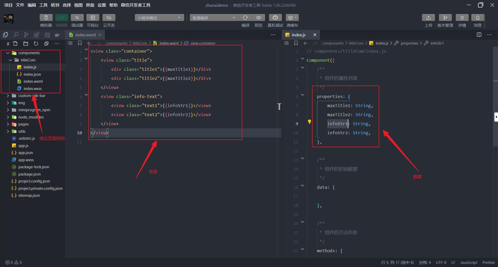

# 标签
- view
- text
- swiper
- template
```javascript
<import src='' /> //导入template 

@import '../../' //导入样式

<include src=''></include> //导入所有结构
```

# 逻辑
- wx:if
- wx:elif
- wx:else
- wx:for 
- wx:key

# 事件
- bandtap 
- catchbind 无冒泡

# 导入导出
```javascript
// 导出
module.exports = {
    get,
    post,
    put,
    remove,
    uploadFile
}

// 导入
const request = require('./request')

//wxml导入.wxs  
<wxs src='' module = 'data'></wxs>
```

# 组件
`结构`


`使用`
```javascript
{
    "usingComponents": {
        "title-com": "/components/titleCom/index",
    }
}
```
