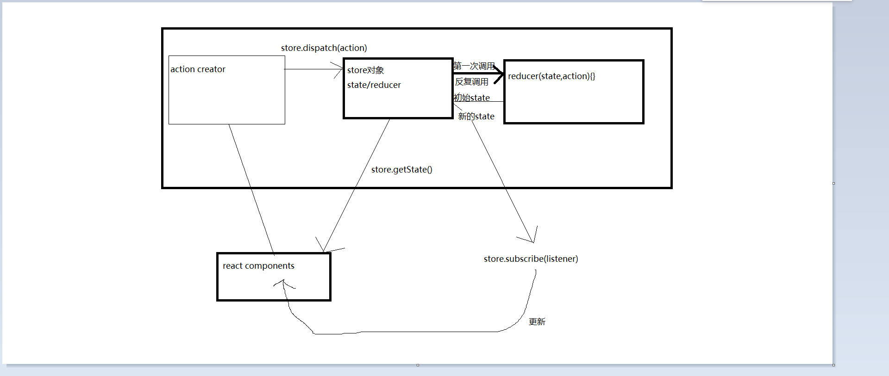

# 组件中使用redux
```javascript
// 引入react-redux插件
# rect-redux核心方法
  - Provider 将状态传入组件
  - connect 将对应的UI组件包装成为容器组件（接收状态和更新状态都要包装成为容器组件）
import { Provider } from 'react-redux'
import { connect } from 'react-redux'

ReactDOM.render(
  <Provider store={store}>
    <App />
  </Provider>,
  document.getElementById('root')
)

// 固定写法（状态和更新操作）
export default connect(
  (state) => ({ headTitle: state.headTitle }),
  {}
)(withRouter(Header))


// 容器组件内获取到状态
const title = this.props.headTitle
```

# redux核心管理状态(store.js)
```javascript
/**
 * redux最核心的管理对象store
 */
import { createStore, applyMiddleware } from 'redux'
// redux处理异步操作
import thunk from 'redux-thunk'
import reducer from './reducer'
// redux开发者工具使用
import { composeWithDevTools } from 'redux-devtools-extension'

// 向外暴露store
export default createStore(reducer,  composeWithDevTools(applyMiddleware(thunk)))
```

# 更新主要操作(reducer.js)
```javascript
/**
 * 用来根据老的state和指定的action生成返回新的stage
 */
import storageUtils from '../utils/storageUtils'
import { combineReducers } from 'redux'
import { SET_HEAD_TITLE } from './action-types'
/**
 * 用来管理头部标题的reducer函数
 */
const initHeadTitle = '首页'
function headTitle(state = initHeadTitle, action) {
  switch (action.type) {
    case SET_HEAD_TITLE:
      return action.data
    default:
      return state
  }
}

/**
 * 用来管理头部标题的reducer函数
 */
const initUser = storageUtils.getUser()
function User(state = initUser, action) {
  switch (action.type) {
    default:
      return state
  }
}

/**
 * 向外暴露的是合并产生的总的reducer函数管理的总的state的结构：
 {
  headTitle: '首页',
  user: {}
 }
 */
export default combineReducers({
  headTitle,
  User,
})

```

# 行为(action.js)
```javascript
/**
 * 包含n个action creator的函数的模块
 * 同步action: 对象{type: 'xxx', data: 数据值}
 * 异步action: 函数 dispatch => {}
 */
import { SET_HEAD_TITLE } from './action-types'
/**
 * 设置头部标题的同步action
 */
export const setHeadTitle = (headTitle) => ({
  type: SET_HEAD_TITLE,
  data: headTitle,
})
```

# 行为类型(action-types.js)
```javascript
/**
 * 包含n个action的type常量标识名称的模块
 */
 export const SET_HEAD_TITLE = 'set_head_title' //设置头部标题
```
# 更新操作顺序
界面点击>action.js>reducer.js>界面

